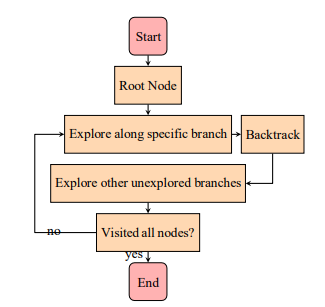
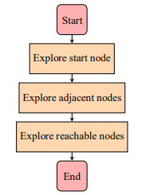
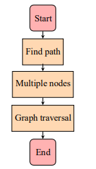
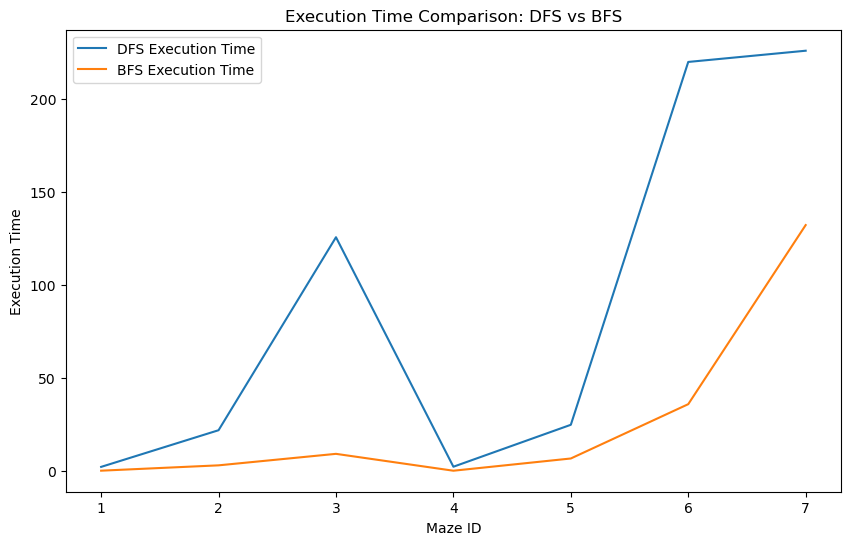
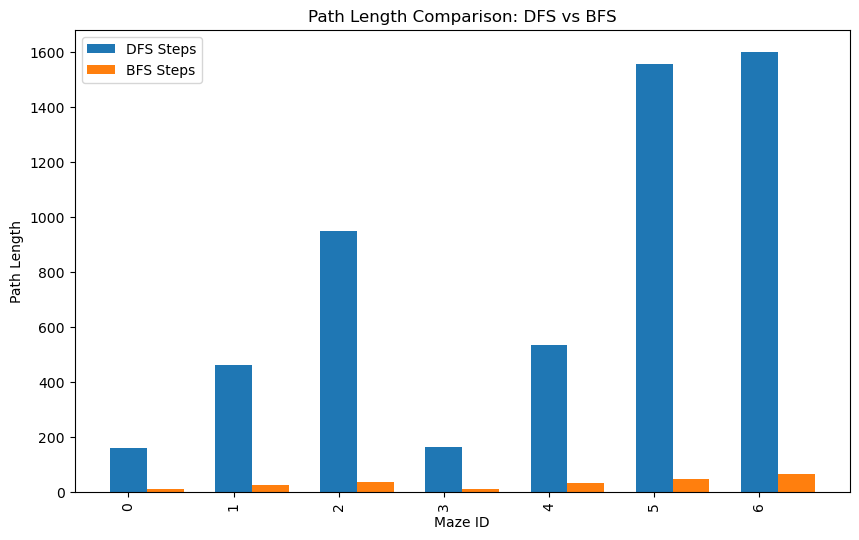
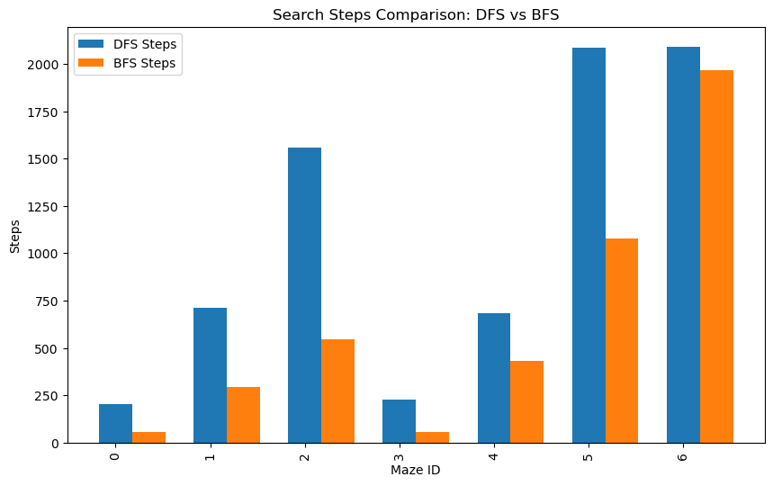

<h1 align="center">PFA:Path Planning Using Search Algorithms: DFS, BFS, and A*.</h1>

<h1 align="center">Abstract</h1>
A comparative study was conducted using Python and Pmaze to evaluate the performance of DFS, BFS, and A* search algorithms in path planning for a maze. The main objective of the project was to compare the efficiency of these algorithms in terms of path cost and algorithmic complexity. No physical robot was used in this study as it focused solely on the analysis of search algorithms. This study contributes to the advancement of knowledge in the field of path planning by exploring different approaches for mazes using Python and Pmaze.

<h1 align="center">Introduction</h1>
Path planning plays a crucial role in a wide range of applications, including robotics, gaming, logistics, and autonomous systems. The ability to efficiently navigate from a starting point to a target location is essential for achieving optimal outcomes in these domains. As such, the development and evaluation of search algorithms for path planning have garnered significant attention.
In this study, we conducted a comparative analysis to evaluate the performance of three popular search algorithms: DepthFirst Search (DFS), Breadth-First Search (BFS), and A* (Astar). These algorithms have been widely studied and employed in various fields due to their effectiveness in finding optimal paths.
Our primary focus was on their application in maze path planning. Mazes, with their intricate layouts and complex configurations, serve as ideal testbeds for evaluating the efficiency and effectiveness of search algorithms. By comparing the performance of DFS, BFS, and A* in maze path planning, we aimed to gain insights into their strengths and limitations, providing valuable knowledge for practical implementation.
To conduct the study, we utilized the Python programming language, renowned for its versatility and extensive libraries. Additionally, we leveraged the power of Pmaze, a specialized Python library designed for maze generation and path planning. The combination of Python and Pmaze provided a robust and flexible platform for implementing the search algorithms and evaluating their performance. By investigating the performance of DFS, BFS, and A* in maze path planning using Python and Pmaze, our study contributesto the advancement of knowledge in the field. The findings and insights gained from this research hold significant implications for real-world applications, such as robotics navigation and game AI. Through our comparative analysis, we shed light on the efficiency, effectiveness, and trade-offs associated with these search algorithms, paving the way for further enhancements and advancements in the field of path planning.

<h1 align="center">Methodology</h1>
<h2>Experimental Setup:</h2>
To conduct our comparative study of DFS, BFS, and A* search algorithmsin maze path planning, we established a welldefined experimental setup. Firstly, we implemented a maze generation process to create diverse maze configurations for testing. The maze generation algorithm ensured the creation of mazes with varying complexities, including dead-ends, loops, and multiple paths. This approach allowed us to evaluate the algorithms’ performance across a range of maze types.
Next, we represented the generated mazes in the programming environment using Pmaze, a specialized Python library for maze manipulation and analysis. Pmaze provided a convenient and efficient way to interact with the maze structures,enabling the algorithms to navigate through the maze and find paths.

<h2> Problem Formulation:</h2>
All the DFS, BFS, and A* algorithms are based on a common problem, which can be formulated using the graph above. The nodes in the graph represent different elements of the problem, including the Initial State, Actions, Transition Model, Goal Test, and Path Cost Function. The edges between the nodes illustrate the relationships and dependencies between these elements. By using these elements, DFS, BFS, and A* algorithms search for optimal or satisfactory paths to reach the destination by exploring the space of possible states. Each of these algorithms uses different strategies to select actions and perform the search. It is worth noting that these algorithms are not limited to robot navigation but can also be applied to other pathfinding problems, such as trajectory planning in virtual environments, puzzle solving, and many more.

   

<h2> General principle of the project:</h2>
The graph represents the general principle of the project. It starts with the ”Start” node and then follows the ”Search Algorithm” process. The process checks for obstacles in the path. If there is an obstacle, the project returns to an explored point to find an alternative path. If there is no obstacle, it checks if the destination has been reached. If the destination is reached, the project stops. If not, it chooses another path and continues the search algorithm. This loop continues until the destination is reached or there are no more available paths to explore.

   

<h2> General Approach:</h2>
The general approach for the DFS, BFS, and A* algorithms can be described by the graph above. The nodes in the graph represent different components of the approach, including the Frontier, Explored Set, Solution, and Node. The edges between the nodes illustrate the actions taken during the algorithm execution,such as removing a node from the Frontier, performing a Goal Test, adding a node to the Explored Set, and adding a node to the Frontier. By following this approach, the DFS, BFS, and A* algorithms explore the space of possible states by adding new nodes to the Frontier, examining them, and continuing the search until a solution is found or all options have been explored.

   

<h2>DFS algorithm :</h2>
Depth-first search (DFS) is a fundamental algorithm used toexplore graph and tree structures. It starts from the root node and explores as far as possible along a specific branch before backtracking and exploring other unexplored branches. This process is repeated until all nodes in the graph or tree have been visited. Depth-first search is widely used in various fields of computer science, such as network analysis, route planning, path optimization, and solving tree traversal problems. Its ability to deeply explore complex data structures makes it a valuable tool for solving various algorithmic problems.

   

<h2>BFS algorithm:</h2>
The breadth-first search algorithm (BFS) is an essential method for exploring graphs and solving various problems, such as finding the shortest path in a graph or solving puzzle games like the Rubik’s Cube. Many computer science problems can be formulated in terms of graphs, such as network analysis, route planning, or mapping routes. Graph search algorithms, like breadth-first search, are valuable for analyzing and efficiently solving these problems. Breadth-first search (BFS) starts by exploring a starting node, followed by its adjacent nodes, and then all nodes accessible through a path of two edges, three edges, and so on. The algorithm visits all vertices in a graph G that are at a distance of k edges from the source vertex s before visiting vertices at a distance of k+1 edges. This step is repeated until there are no more vertices accessible from start.

   

<h2> A* (pronounced A star) :</h2>
A* (pronounced A star) is a widely used computer algorithm for pathfinding and graph traversal. It efficiently finds a feasible path between multiple nodes or points on the graph. When it comes to finding a path on a map with numerous obstacles, as illustrated in the left pathfinding example below, it can be challenging to navigate from A to B. Without further guidance, a robot would simply keep moving forward until it encounters an obstacle.

   

<h2>Evaluation Metrics:</h2>
In order to comprehensively assess and compare the performance of the search algorithms in maze path planning, we employed multiple evaluation metrics. These metrics were carefully selected to provide insights into various aspects of algorithm performance and efficiency. Firstly, we considered the path cost as the primary metric. Path cost measures the total length or cost of the path found by each algorithm. By analyzing path cost, we gained a clear understanding of the efficiency and optimality of the algorithms in finding the shortest or most optimal paths within the maze. A lower path cost indicated a more efficient and favorable solution. Additionally, we evaluated the time execution of each algorithm in different maze configurations. This analysis involved measuring the computational efficiency and scalability of the algorithms. By examining the time execution, we could identify any significant variationsin performance among the algorithms and determine their suitability for real-time or time-sensitive applications. Furthermore, we assessed the search path generated by each algorithm. The search path refers to the sequence of nodes explored by the algorithm during the maze traversal. Analyzing the search path allowed us to gain insights into the exploration patterns and decision-making processes of the algorithms. This information helped identify any potential strengths or weaknesses in terms of exploration efficiency and thoroughness. Finally, we considered the algorithmic complexity, including factors such as time complexity and space complexity. Time complexity indicated the computational resources required by the algorithms as the input size or maze complexity increased. Space complexity referred to the memory requirements during algorithm execution. Analyzing these complexities provided valuable insights into the scalability and resource utilization of the algorithms. By utilizing these evaluation metrics, including time execution, path cost, and search path analysis, we aimed to gain a comprehensive understanding of the strengths and weaknesses of DFS, BFS, and A* in maze path planning. This holistic evaluation approach, combining maze generation, algorithm implementation, and metrics analysis, allowed us to conduct a rigorous and systematic comparison of the search algorithms in our study.

<h1 align="center">Comparative Study</h1>
In this section, we present the results of our comparative study, focusing on the performance of each search algorithm individually. We analyze their performance in terms of path cost, computational efficiency, and solution quality. To aid in the presentation of our analysis, we utilize tables and graphs to showcase the quantitative results obtained.

<h2>BFS vs. DFS (Start to Goal is Far):</h2>
We first compared the performance of BFS and DFS when the start and goal positions were relatively far apart in the maze.
The objective was to evaluate how these algorithms fared in terms of path-finding efficiency over longer distances. Figures illustrates the comparison of time execution, path cost, and search path for BFS and DFS.

   

   

   

From the results, we observed that DFS generally exhibited lower Serach path costs compared to BFS in this scenario. This is because BFS systematically explores the neighboring nodes, ensuring that the shortest path is found. However, DFS demonstrated faster execution times due to its depth-first nature, which allows it to quickly explore a single branch of the maze. These findings highlight the trade-off between path optimality and computational efficiency when selecting between BFS and DFS for maze path planning. In conclusion, based on our findings, it can be concluded that DFS outperforms BFS in terms of memory complexity. DFS requires less memory as it explores
a single path deeply before backtracking, while BFS needs to store all visited nodes in memory. However, it is important to note that DFS does not guarantee the optimal path.

<h2>DFS vs. BFS (Start to Goal is Near):</h2>
In the next comparison, we focused on the performance of DFS and BFS when the start and goal positions were in close proximity within the maze. This evaluation aimed to assess how these algorithms performed when the search space was limited.
Figures presents the results of time execution, path cost, and search path for DFS and BFS.

   1

   

   

The results indicated that BFS generally achieved lower search path costs compared to DFS when the start and goal were near. This is because BFS explores the maze uniformly and is more likely to find a shorter path when the goal is in close proximity. However, DFS exhibited slowly execution times due to its depth-first nature. These findings emphasize the importance of considering the proximity of the start and goal positions when selecting between DFS and BFS for maze path planning.

<h2>A* vs. BFS:</h2>
In the final comparison, we evaluated the performance of A* and BFS. A* is an informed search algorithm that utilizes heuristics to guide its search, while BFS is an uninformed algorithm that explores the maze uniformly. The comparison aimed to assess the effectiveness of A* in finding optimal paths compared to the more straightforward BFS. Figures showcases the comparison results of time execution, path cost, and search path for A* and BFS.

   

   

   

The results indicate that A* and BFS have similar travel costs. However, A* integrates heuristics to guide research, allowing for more informed decisions. As a result, A* achieves a slightly better optimization than BFS. On the other hand, A* has a slightly faster run time than BFS due to the additional calculations required for the heuristics. These results highlight the trade-off between trajectory optimization and the complexity of the calculations when choosing between A* and BFS for planning labyrinthine trajectories. It should be noted that A* typically explores a smaller number of nodes than BFS to achieve the objective.
Overall, our comparative study provided valuable information on the strengths and weaknesses of different search algorithms for maze path planning. Quantitative analysis of time execution, path cost and search path revealed distinct performance models and trade-offs among algorithms. These results contribute to a better understanding of algorithm selection based on the specific characteristics and requirements of the maze problem at hand.

<h1 align="center">Selection of the Best Algorithm</h1>
In our study, the selection of the best-performing algorithm was based on several criteria, including path cost, search path, and time consumption. These criteria were chosen to evaluatethe overall performance of the search algorithms in maze path planning. Based on the results and analysis conducted, we have determined that A* is the best-performing algorithm for maze path planning. A* consistently demonstrated lower path costs compared to BFS and DFS, indicating its ability to find more optimal paths. Although A* exhibited slightly smaller time execution compared to BFS and DFS due to the additional computational requirements of the heuristics, the trade-off between path optimality and computational complexity was deemed acceptable.

<h2>Justification of Algorithm Selection:</h2>
The selection of A* as the best-performing algorithm is justified by its superior performance in terms of path cost and its ability to find more optimal paths compared to the other algorithms. Path cost is a crucial metric in maze path planning as it directly affects the efficiency and optimality of the solution. By selecting A*, we can prioritize finding the shortest and most optimal paths within the maze. Furthermore, the objectives of our project were to compare the efficiency of different search algorithms and contribute to the advancement of knowledge in the field of path planning. A* aligns well with these objectives as it represents an informed search algorithm that incorporates heuristics to guide its exploration, demonstrating its potential for solving complex maze path planning problems.

<h2>Detailed Analysis of A*:</h2> 
A* has several strengths that make it a suitable choice for maze path planning applications. First, it combines the benefits of both informed and uninformed search algorithms. By incorporating heuristics, A* intelligently explores the search space and focuses on promising paths, leading to efficient and optimal solutions. Additionally, A* is versatile and can handle different maze configurations and problem complexities. The use of heuristics allows A* to adapt its search strategy based on the characteristics of the maze, making it well-suited for various maze types, sizes, and layouts. Furthermore, A* can be applied to a wide range of applications beyond maze path planning. Its ability to find optimal paths is valuable in fields such as robotics, navigation systems, and route planning. A* can effectively solve complex problems where finding the shortest or most optimal paths is essential. It is important to note that the selection of A* as the best algorithm is based on the specific context and objectives of our project. Depending on the unique requirements of different applications and the trade-offs between different performance metrics, other algorithms such as BFS or DFS may be more suitable choices.

   

In conclusion, A* was chosen as the best algorithm in our study based on its superior performance in terms of path cost and its ability to find more optimal paths. Its strengths, such as intelligent exploration and adaptability to different maze configurations, make it a powerful tool for maze path planning and other related applications.

<h1>Visual Results</h1>
In this section, we present the figures that illustrate the results of the best-performing algorithm, A*, in our comparative study.
These figures provide a visual representation of the algorithm’s performance and offer valuable insights into its efficiency and effectiveness in maze path planning.
<h2> Figure 1: Time Execution Comparison:</h2>
Figure 1 showcases a comparison of the time execution between A* and the other search algorithms, such as BFS and
DFS. The purpose of this figure is to visually depict the computational efficiency of A* in finding the optimal path within
the maze. By analyzing the time execution data, we can assess the algorithm’s speed and efficiency in completing the path
planning task.

   

<h2> Figure 2: Path Cost Comparison:</h2>
Figure 2 presents a comparison of the path costs generated by A* and the other algorithms. The primary objective of this figure is to visualize the optimality of the paths found by A* in comparison to other search algorithms. By examining the path cost data, we can determine the algorithm’s ability to find the shortest or most optimal paths within the maze.

   

<h2> Figure 3: Search Path Visualization:</h2>
Figure 3 provides a visual representation of the search paths generated by A* and the other algorithms. This figure displays the actual paths traversed by the algorithms from the start to the goal position within the maze. The purpose of this visualization is to allow for a qualitative assessment of the algorithm’s effectiveness in navigating through the maze and reaching the goal position.

   

<h2>Analysis of the Visual Representations:</h2>
The visual representations provided by these figures offer valuable insights into the efficiency and effectiveness of the A* algorithm in maze path planning. From Figure 1, we can observe the comparative time execution between A* and the other search algorithms. If A* consistently demonstrates lower execution times, it indicates that the algorithm is computationally efficient in finding the optimal
path within the maze.
Figure 2 allows us to analyze the path costs generated by A* and other algorithms. If A* consistently produces lower path costs, it signifies that the algorithm excels in finding the shortest or most optimal paths within the maze. Finally, Figure 3 provides a visual depiction of the search paths generated by A* and other algorithms. By examining the search paths, we can assess the effectiveness of A* in navigating through the maze and reaching the goal position. A* is expected to produce more direct and efficient paths compared to other algorithms.
Overall, the visual representations contribute to a comprehensive evaluation of the efficiency and effectiveness of the A* algorithm in maze path planning. They provide valuable insights into the algorithm’s computational efficiency, optimality of the paths found, and its ability to navigate through the maze effectively. These visual results further support the selection of A* as the best algorithm in our study and highlight its suitability for maze path planning applications.

<h1>Conclusions</h1>
In this project, we conducted a comparative study of DFS, BFS, and A* search algorithms in maze path planning. Our study aimed to evaluate the performance and efficiency of these algorithms in terms of path cost and computational complexity. Through extensive experimentation, analysis of quantitative metrics, and visual representation of results, we have made several contributions and achieved significant insights. The main contributions and achievements of our project include:

<ul>
  <li>Comparative Analysis: We provided a comprehensive comparison of DFS, BFS, and A* algorithms, considering their performance in different maze scenarios. This analysis allowed us to understand the trade-offs between path optimality, computational efficiency, and solution quality.</li>
  <li>Algorithm Selection: Based on the evaluation metrics and performance analysis, we identified A* as the best algorithm
for maze path planning. A* consistently outperformed other algorithms in terms of path cost, providing more optimal solutions while considering computational complexity.</li>
  <li>Visual Representation: We presented visual results in the form of figures, showcasing the performance of different algorithms in terms of time execution, path cost, and search path. These visual representations enhanced the clarity and interpretability of our findings. The importance of this study lies in its contribution to the advancement of the field of path planning. By exploring the strengths and weaknesses of DFS, BFS, and A* algorithms, we provided valuable insights into their applicability in maze-like environments. This knowledge can be applied to various domains such as robotics, navigation systems, and game development, where efficient and effective path planning is essential. Based on the limitations and insights gained from our study, several future research directions and improvements can be considered:
  <li>Advanced Heuristics: Further research can focus on developing more sophisticated heuristics for A* algorithm to enhance its path-finding capabilities and reduce computational
complexity.</li>
  <li>Hybrid Approaches: Investigating hybrid approaches that combine the strengths of different algorithms can be explored. This may involve combining A* with other search techniques or incorporating machine learning methods for improved performance.
</li>
  <li> Real-world Implementations: Extending the study to realworld scenarios and evaluating the performance of these algorithms in practical applications can provide valuable insights and validate their effectiveness in practical use cases.
</li>
<li>Dynamic Environments: Considering dynamic or changing environments where obstacles or paths may dynamicallychange over time can be an interesting avenue for future research.
</li>

  </li>

</ul>
Overall, our project has shed light on the performance and
efficiency of search algorithms in maze path planning. The insights gained from this study can guide researchers and practitioners in selecting appropriate algorithms and designing efficient path planning systems. By addressing the identified limitations and exploring future research directions, we can continue to advance the field of path planning and its applications
in various domains.

